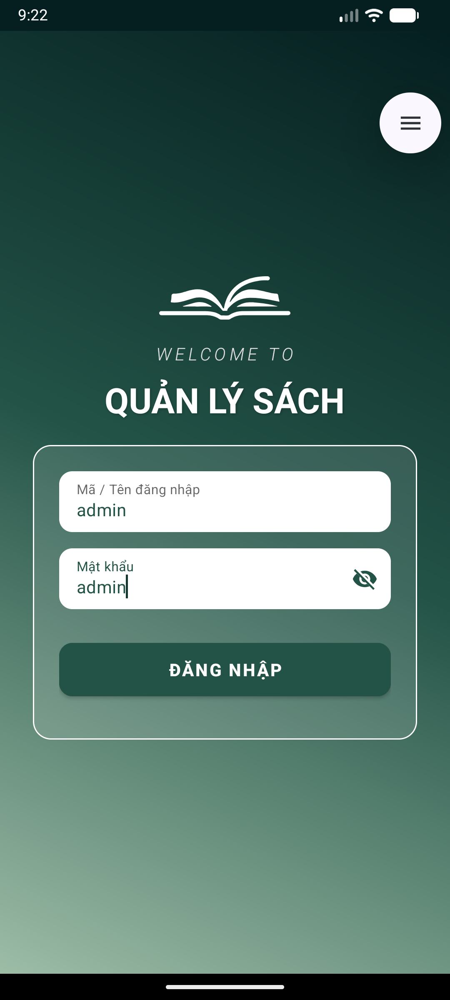
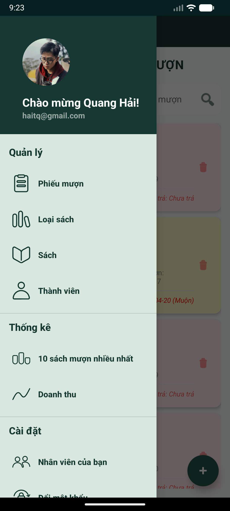
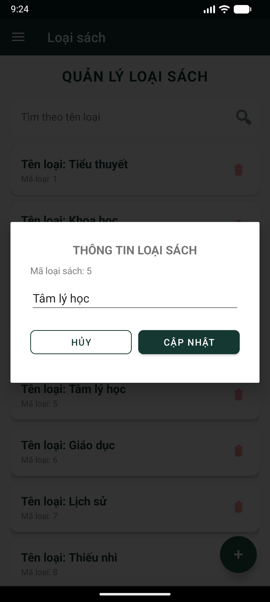

# 📚 Ứng Dụng Quản Lý Thư Viện (Book Management App)

Đây là một ứng dụng Android chuyên nghiệp giúp quản lý sách, loại sách và thông tin thành viên trong thư viện. Dự án được xây dựng với mục tiêu tối ưu hóa quy trình quản lý và mang lại trải nghiệm người dùng tốt nhất trên nền tảng di động.

## 📸 Hình ảnh minh họa

<p align="center">
  
  
  
</p>

<p align="center"><i>(Giao diện Đăng nhập - Chính - Danh mục)</i></p>

## ✨ Tính năng chính

- [x] **Hệ thống Đăng nhập:** Bảo mật thông tin, phân quyền truy cập.
- [x] **Quản lý Loại sách:** Thêm mới, cập nhật thông tin và xóa các danh mục sách một cách linh hoạt.
- [x] **Quản lý Thành viên:** Lưu trữ và truy xuất chi tiết thông tin thành viên (Họ tên, Năm sinh, Số điện thoại, Địa chỉ...).
- [x] **Giao diện Hiện đại:** Sử dụng Material Design, Navigation Drawer giúp điều hướng mượt mà.
- [x] **Trải nghiệm người dùng:** Giao diện trực quan, dễ thao tác và phản hồi nhanh.

## 🛠 Công nghệ sử dụng

- **Platform:** Android SDK
- **Language:** Java/Kotlin
- **UI Design:** XML, Material Components, Vector Graphics.
- **Architecture:** Fragment-based Navigation, Responsive Layouts.
- **IDE:** Android Studio.

## 🚀 Hướng dẫn cài đặt

1. **Clone dự án:**
   ```bash
   git clone https://github.com/truongquanghai/book-management-app.git
   ```
2. **Mở dự án:** Khởi động Android Studio và chọn `Open` trỏ đến thư mục dự án.
3. **Build & Run:** Chờ quá trình đồng bộ Gradle hoàn tất, sau đó nhấn nút `Run` (biểu tượng Play) để chạy ứng dụng trên máy ảo hoặc thiết bị thật.

## 👨‍💻 Tác giả

- **Họ tên:** Trương Quang Hải
- **GitHub:** [truongquanghai](https://github.com/truongquanghai)
- **Dự án:** Quản lý thư viện (Android)

---
*Dự án này được phát triển với mục đích học tập và xây dựng kỹ năng lập trình Android.*
